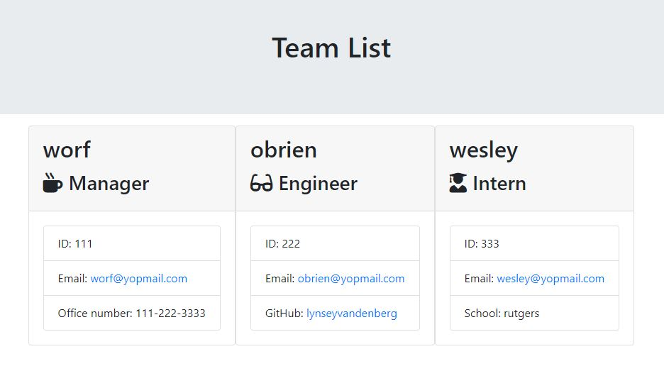

# Team Profile Generator
## Description:
The Team Profile Generator is a command line tool that allows the end user to input employee information. The initla prompt asks the user to select a role (manager, engineer, or intern), then from there they receive a series of prompts to input additonal information (name, ID, email, etc.). Once the user is finished entering the employee information, an HTML file is rendered which shows the inputted employee information (image shown below).

---

## Acceptance Criteria:
* GIVEN a command-line application that accepts user input
* WHEN I am prompted for my team members and their information
* THEN an HTML file is generated that displays a nicely formatted team roster based on user input
* WHEN I click on an email address in the HTML
* THEN my default email program opens and populates the TO field of the email with the address
* WHEN I click on the GitHub username
* THEN that GitHub profile opens in a new tab
* WHEN I start the application
* THEN I am prompted to enter the team manager’s name, employee ID, email address, and office number
* *HEN I enter the team manager’s name, employee ID, email address, and office number
* THEN I am presented with a menu with the option to add an engineer or an intern or to finish building my team
* WHEN I select the engineer option
* THEN I am prompted to enter the engineer’s name, ID, email, and GitHub username, and I am taken back to the menu
* WHEN I select the intern option
* THEN I am prompted to enter the intern’s name, ID, email, and school, and I am taken back to the menu
* WHEN I decide to finish building my team
* THEN I exit the application, and the HTML is generated
---
## Demo:
*In this video, I executed a test in JEST, then ran through the app to generate the employee team list webpage.*

https://user-images.githubusercontent.com/81693557/123578954-dbf7f180-d7a4-11eb-8ac7-b98424826160.mp4

